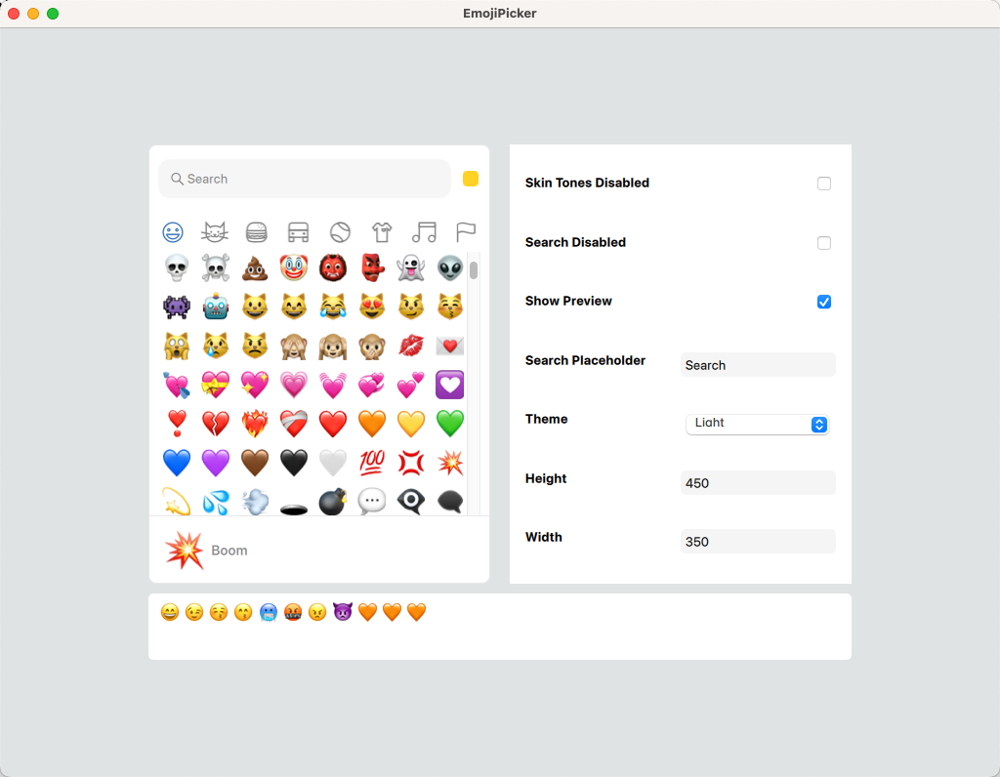

# QML Emoji Picker



## About
A QML Implementation of Emoji Picker for Qt/QML applications.

This project is an implementation of [Emoji Picker React](https://github.com/ealush/emoji-picker-react).

## Installation
* Clone the repository into somewhere in your project directory, for example as a submodule:

```bash
git submodule add https://github.com/huangcheng/qml-emoji-picker.git third_parties/qml-emoji-picker
```

* Add into your project's `CMakelists.txt`:

```cmake
add_subdirectory(third_parties/qml-emoji-picker)

target_link_libraries(${PROJECT_NAME} PRIVATE EmojiPickerplugin)
```

* Add into your project's `main.cpp`:

```cpp
engine.addImportPath(QStringLiteral(":/cheng.im/qml"));
```

This adds the `:/cheng.im/qml` resource prefix to the QML engine, so that it can find the QML files.

## Usage
```qml
import im.cheng.EmojiPicker

EmojiPicker {
    width: 350
    height: 450

    theme: 'light'
    defaultSkinTone: 'neatral'
    skinTonesDisabled: false
    searchPlaceholder: 'Search'
    searchDisabled: false

    onEmojiClicked: function (emoji) {
        console.log(emoji)
    }
}
```

## Links
1. [Documentation](https://huangcheng.github.io/qml-emoji-picker/qml-emojipicker.html)
2. [Demo](https://github.com/huangcheng/EmojiPickerDemo/)

## License
MIT
